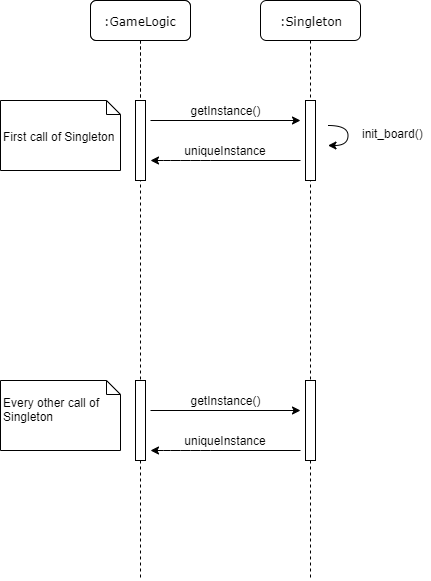
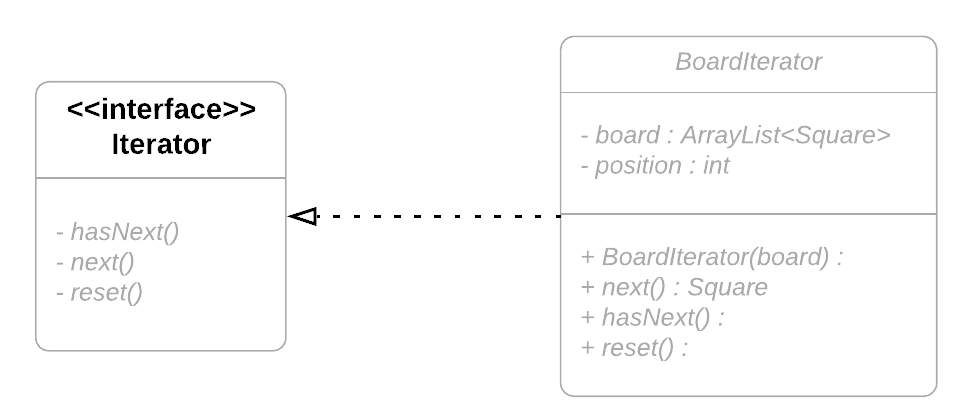
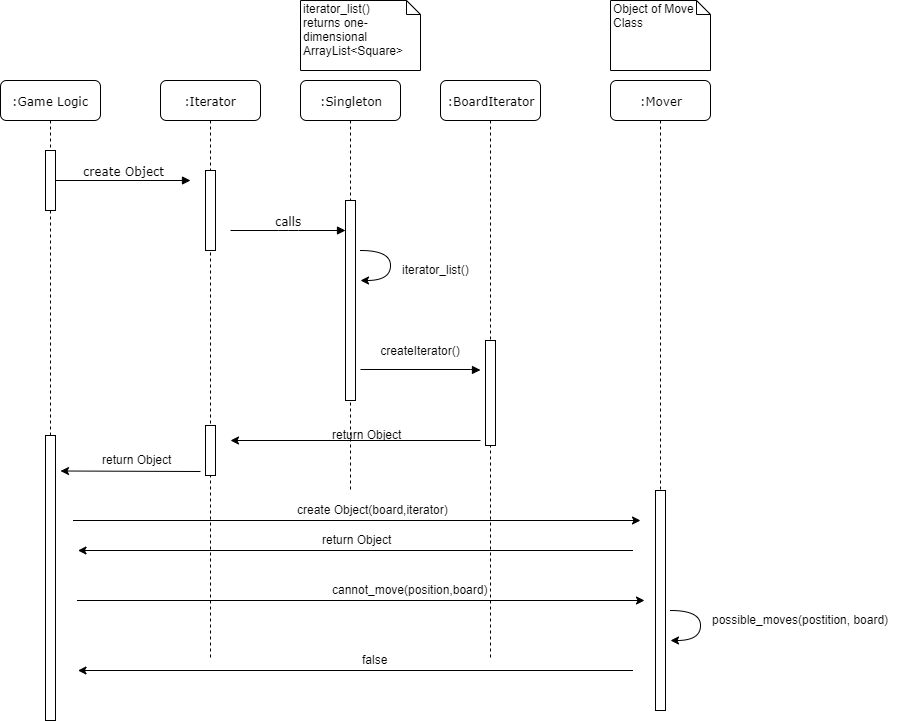
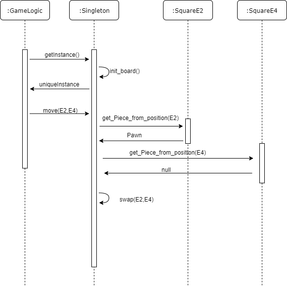

***Assignment 3***

**Task 1**

In Task 1 we chose to implement the Singleton and Iterator design pattern.

**Singleton**

*1.1* Singleton was implemented for the Board. 
We renamed the board class to Singleton (to follow naming convention) to make it clear that only one chess board at a time should exist. 

Our Implementation of the Singleton design pattern follows the structure as indicated in the lecture.

*1.2* Class diagram Singleton  
  

*1.3* Sequence diagram Singleton

  

**Iterator**

*1.1* We decided on the Iterator design pattern because we need to loop over our board multiple times and the iterator design pattern makes this more clear.
We followed the rules for the Iterator design pattern as shown in the lecture.

We have the Interface Iterator which is implemented in the BoardIterator class.
Iterator is created in the Board/Singleton class and used in the Move class.

Following methods use the iterator:
possible_moves(), get_Kings_position(), is_check(), is_promotion() and swap_scharade() 

*1.2* Class diagram Iterator  

*1.3* Sequence diagram Iterator

**Task 2**

**Task 3**

We have chosen to implement the Observer Pattern. We tried to model our solution after the one shown in the lecture.

Our actual observer is called Scoreboard and its Interface is called Observer.

In the Scoreboard class the only method is update() which is used to update the scores.

The rest of the implementation is in the Board or rather Singleton class. There are functions to register, remove and notify observers.

The method scoreChanged() is used after every move to update/notify the scoreboard.

