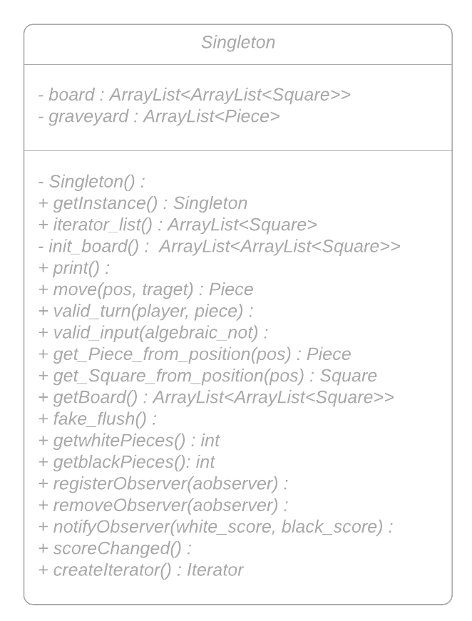
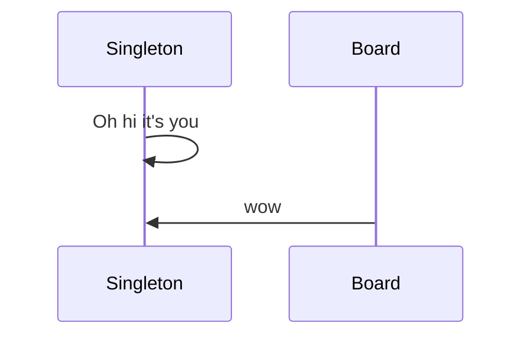
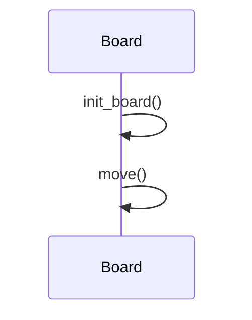

***Assignment 3***

**Task 1**
In Task 1 we chose to implement the Singleton and Iterator design pattern.
1.1 Singleton was implemented for the Board. We renamed the board class to Singleton to make it even more clear.
2.1


```

3.Sequence diagram Singleton

4.Sequence diagram Iterator



**Task 2**


**Task 3**

We have chosen to implement the Observer Pattern. We tried to model our solution after the one shown in the lecture.

Our actual observer is called Scoreboard and its Interface is called Observer.

In the Scoreboard class the only method is update() which is used to update the scores.

The rest of the implementation is in the Board or rather Singleton class. There are functions to register, remove and notify observers.

The method scoreChanged() is used after every move to update/notify the scoreboard.

