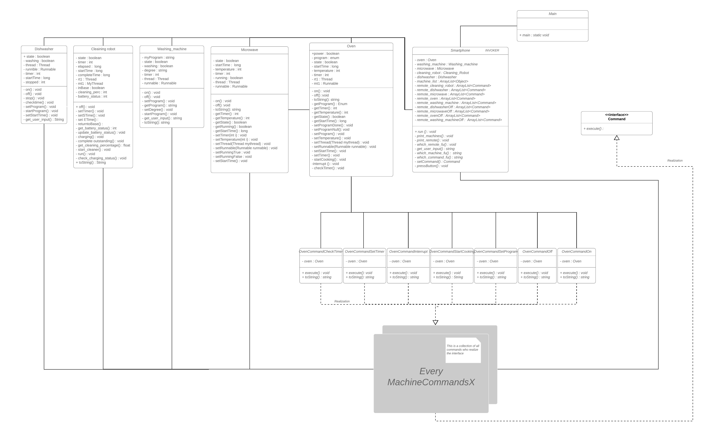

#Assignment 4 Smart Home

- We implemented the Smarthome App and tried to make it as intuitive as possible.
- The command pattern design is the only design we used. Furthermore we used interfaces for our Commands.
- Each Appliance in the Smarthome has commands to control them. 
- Also we decided to use packages in order to organize our code.

**How to use the app:**

- To choose a machine, type the first captial letter of the machine. It must be uppercase. e.g. D for dishwasher
- To choose a command of a machine, type the button number. e.g. 1 for [1][ON]
- To choose a program for example a oven, type in the program name eg. Grill for [Grill]
- For the temperature -1 is the default value, if no temperature has been set.
- Everytime you are in the "SMARTHOME APP" you can exit the app by typing "e"

**Class Diagram**

In the class diagram, we did not put every Command class in the UML because that would be unnecessary and very big.
Instead we put a container MachineCommandx which should represent all Command classes.
However, we put there all oven command classes to show how each machine command should look like.

